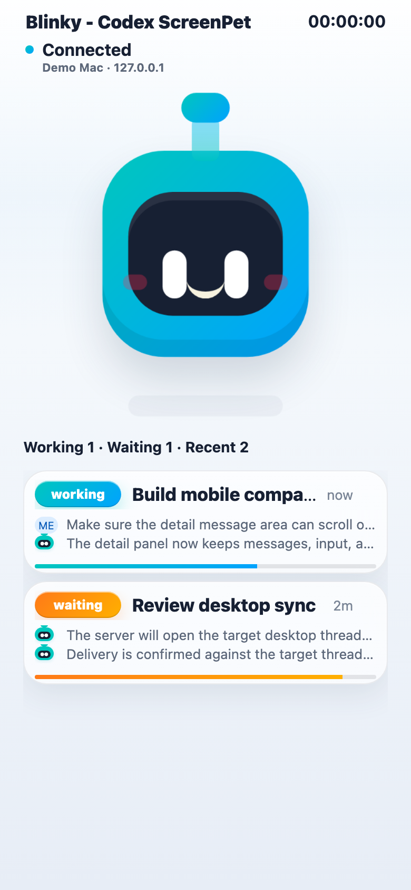
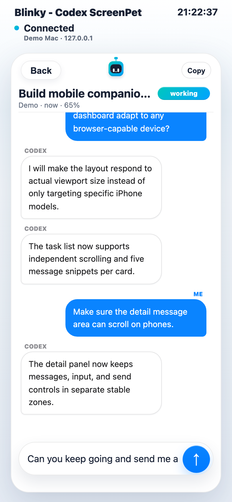
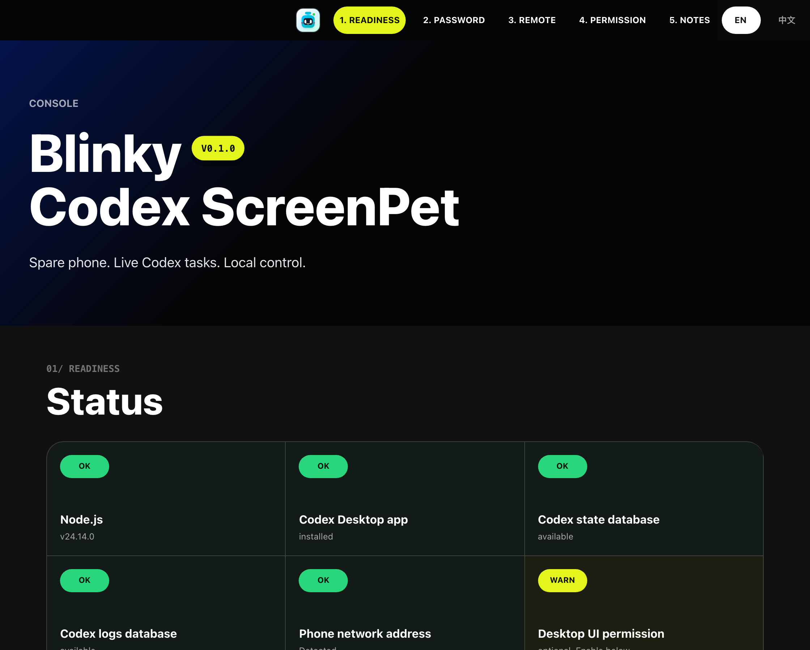
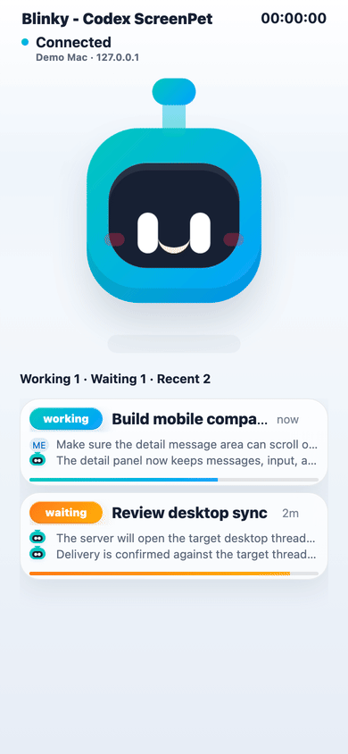

# Codex ScreenPet

Stop waiting on AI. Let Blinky keep watch.

Turn any spare phone, tablet, or browser-capable screen into a local-first live dashboard for Codex Desktop tasks.

Blinky is a free macOS beta for Codex power users. Run it on the Mac where Codex Desktop lives, open the phone page on an old iPhone, Android phone, tablet, or another spare screen, and keep an eye on recent Codex tasks without constantly switching windows.

> Unofficial project. Not affiliated with or endorsed by OpenAI.

## Download for macOS

**Most users should download this file:**

[Download Blinky Codex ScreenPet for macOS](https://raw.githubusercontent.com/kennyzhaoo/codex-screenpet/main/downloads/Blinky-Codex-ScreenPet-v0.1.5.dmg)

After downloading, open the DMG, read `READ ME FIRST.pdf` if you want the illustrated guide, drag `Blinky Codex ScreenPet.app` into **Applications**, then open it from Applications on the Mac that runs Codex Desktop.

This link points to GitHub's raw download URL so it should start downloading directly. If GitHub opens a file page instead, click **View raw**.

The other files in `downloads/` are for the app's runtime update system, not for first-time manual installation.

### macOS beta install note

This free beta is not yet signed with an Apple Developer ID or notarized by Apple. macOS may say it cannot verify the app, or it may ask you to allow it in **System Settings -> Privacy & Security**. That is expected for this early GitHub beta.

Only open software you trust. If you want to try this beta, use **right-click -> Open** first. If macOS still blocks it, open **System Settings -> Privacy & Security** and choose **Open Anyway** for Blinky.

Advanced fallback after installing to Applications:

```sh
xattr -dr com.apple.quarantine /Applications/Blinky\ Codex\ ScreenPet.app
```

A Developer ID signed and notarized build is planned if there is enough real demand.

## Screenshots









## Quick Start

1. Download the macOS beta DMG from the link above.
2. Open the DMG and read `READ ME FIRST.pdf` if you want the illustrated install guide.
3. Drag `Blinky Codex ScreenPet.app` into **Applications**.
4. Open `Blinky Codex ScreenPet.app` from Applications on the Mac that runs Codex Desktop.
5. Open Setup from the menu bar app. If the local server is stopped, Blinky starts it first and opens Setup after it is ready.
6. Use the shown phone URL or QR code on your phone or tablet.
7. Enter the Blinky password shown on the Mac setup page.

The menu bar app starts the local server with Node.js from common macOS installs, including Homebrew, nvm, Volta, mise, asdf, or the Codex Desktop bundled runtime.

Use `http://` for local and private-network access unless you add your own TLS proxy.

## Safety Notes

- This is meant for trusted local/private networks.
- Do not expose the local server directly to the public internet.
- The instruction endpoint can send text into Codex Desktop.
- The local phone password helps prevent casual access on a private network, but it is not a replacement for HTTPS, account auth, or device pairing.
- Demo screenshots and GIFs use fake tasks; no real Codex conversations are included here.

## Source Availability

The development source repository is private for now. This public repo is a marketing/download surface for beta artifacts, screenshots, documentation, and feedback links. The source code is not licensed as open source unless a separate written license says otherwise.

## Update Channel

This beta app was built with a default runtime update manifest URL: `https://raw.githubusercontent.com/kennyzhaoo/codex-screenpet/main/downloads/codex-screenpet-runtime-manifest.json`.

Runtime updates only replace the web dashboard, setup page, local server, scripts, and examples. Native menu bar app updates are shipped as a new app download.

## Release Metadata

- Version: `0.1.5`
- Release tag: `v0.1.5-beta.1`
- Runtime version: `0.1.5+8176bb4`
- Git revision: `8176bb4`
- Generated from dirty worktree: `false`
- macOS download: `Blinky-Codex-ScreenPet-v0.1.5.dmg`

## Feedback

Open an issue or send feedback with your macOS version, Codex Desktop version, device/browser, network type, and the delivery channel shown after sending (`Desktop UI`, `Desktop follower`, `Codex RPC`, or `Queued`).
